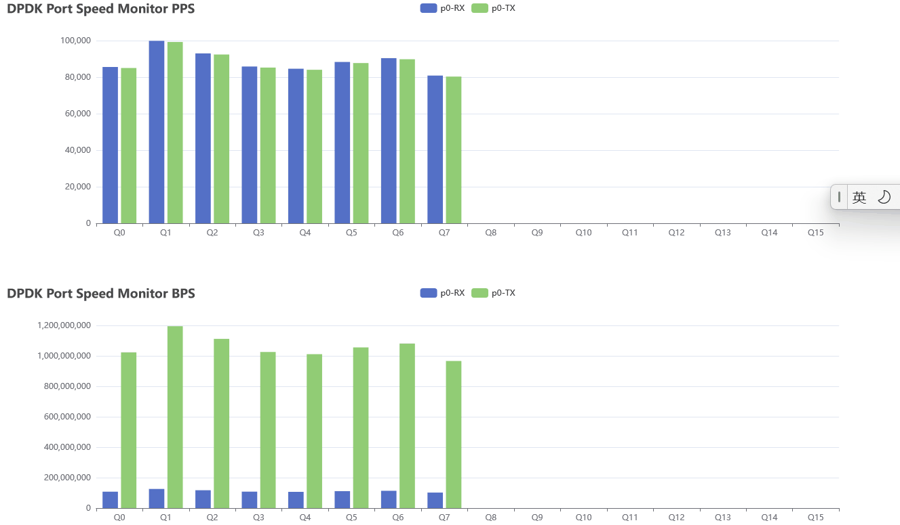

# Simple-DPDK-Speed-Monitor

#### 介绍
简单的DPDK的端口队列速率可视化监视程序，通过DPDK-telemetry、flask、echarts实现

#### 软件架构
1. 通过DPDK提供的遥测接口，获取DPDK端口和队列实时的报文数量和字节数量，利用python perf来获取时间戳，最后计算获取端口和队列的bps以及pps;
2. 网页通过python flask实现，echarts框架用来渲染生成柱状图；
3. 可支持多个端口，默认监视16对RX-TX队列，即使没有分配那么多。
#### 使用说明

1.  网页版本:
    * 安装DPDK并运行DPDK程序
    * `pip install flask`
    * 进入`dpdk-speed/dpdk-speed-app`,运行`./main.py`,用浏览器打开对应网页即可

2.  命令行版本
    * 安装DPDK并运行DPDK程序
    * 进入`dpdk-speed/`，运行`./dpdk-speed.py`

